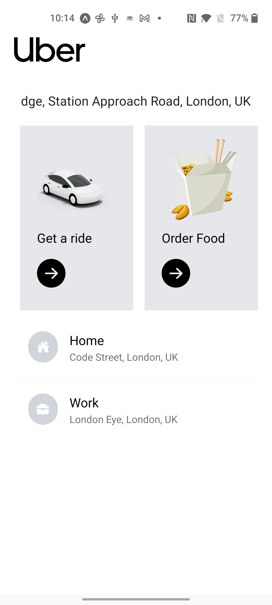
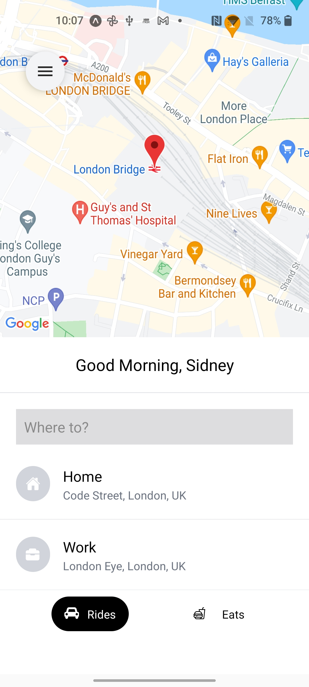

# react-native-uber-clone

Uber clone for react-native.

###Setup  
Create a .env file with GOOGLE_MAPS_API_KEY=
https://console.cloud.google.com/google/maps-apis/credentials

###APIs
Uber clone uses the Directions API, Distance Matrix API, and Places API of Google Maps Platform.

### Source 
This project follows the Sonny Sangha's tutorial at https://www.youtube.com/watch?v=bvn_HYpix6s

